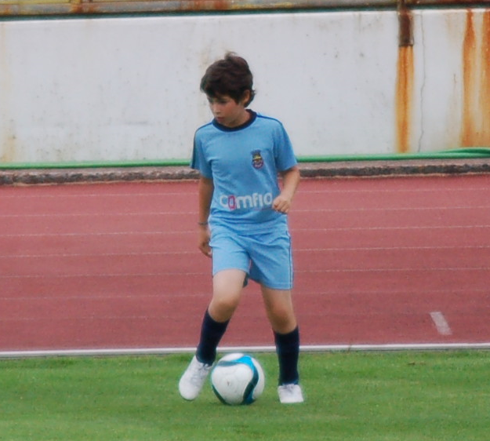

Football is, and always will be, my biggest passion. A big part of my childhood was spent playing football, and some of my earliest memories are with a ball at my feet. Whether it was at home, at school during recess, in the streets, or at local clubs, football was always there. Some of my fondest memories come from just playing the game, and I made a lot of friends through it along the way.

More than just a game, football is a way of connecting and bringing people together.

---

## FC Porto and the Portuguese National team

I am a lifelong supporter of **FC Porto**. Born and raised in the city, supporting the club felt natural. Growing up, I idolized players like **Quaresma, Lucho, Hulk, Falcao, James Rodríguez**.

I've been lucky to experience more highs than lows as a fan, with iconic moments such as:

- [**Kelvin's 92nd goal against Benfica**](https://www.youtube.com/watch?v=aOqGMCWdRMc) to put us on course to win the title  
- [**Winning the Europa League**](https://www.youtube.com/watch?v=c_UxWhnXzrU) 
- [**Herrera's 90th-minute goal in Estádio da Luz**](https://www.youtube.com/watch?v=YAieAjEgpMg), which helped us regain 1st place and clinch the league title

(I was too young to remember winning the Champions League in 2004)

As a Portuguese citizen, though, my biggest football memory will always be [**Edér's 2016 goal**](https://youtu.be/H8yLVIiFQHY?si=ktGNJY0HI0jXkY7o&t=383) that gave Portugal its first European trophy. 

---

## ⚽ My Playing Career

I played for local clubs throughout my youth, mainly **FC Maia Lidador** and **Escola de Futebol 115**. You can check out my player profile [here](https://www.zerozero.pt/jogador/david-rocha/734930?search=1)!
